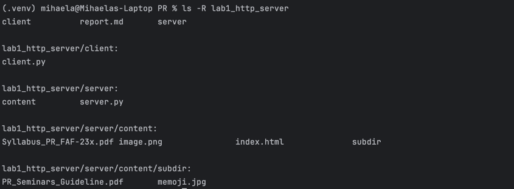
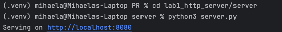
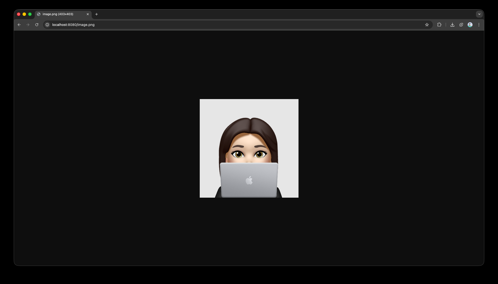
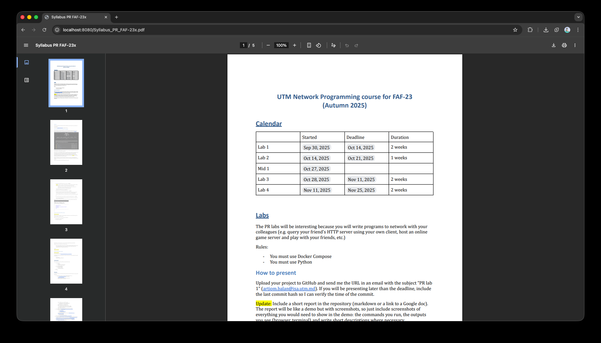
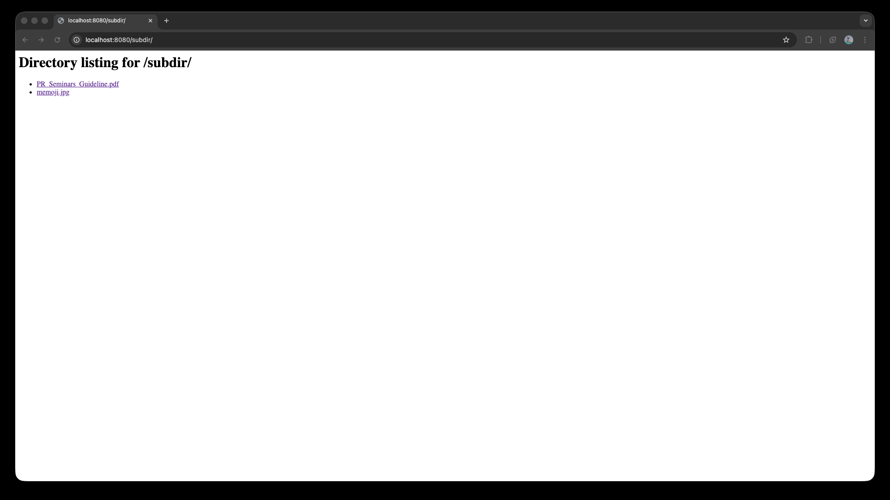
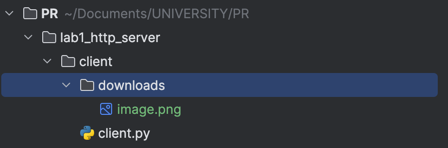
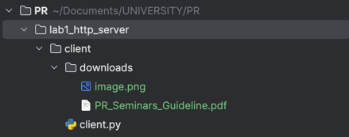
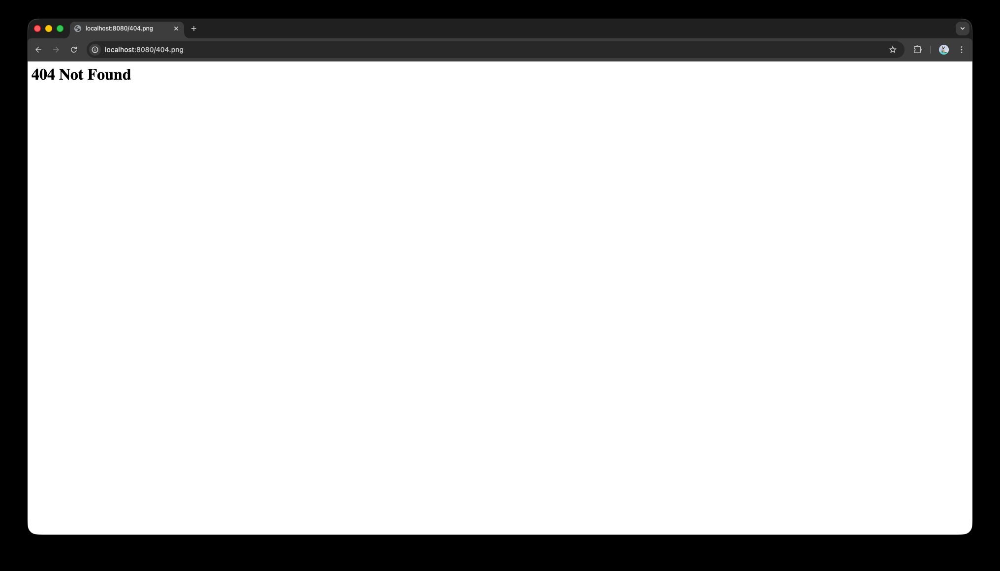

# Lab 1: HTTP File Server & Client
In this lab, I implemented a simple HTTP file server and client using Python's built-in libraries and TCP sockets. 
The server is capable of serving HTML, PNG, and PDF files, including nested directories.
Additionally, I created an HTTP client that can request files from the server and save them locally.

## 1. Server Implementation
### Directory Structure


### Running the Server
To run the server, make sure you are in the correct directory `cd lab1_http_server/server`, then use the following 
command: `python3 server.py`



### Browsing Requests
After running the server, we can access it through a web browser at http://localhost:8080/. The browser sends HTTP 
requests to the server, which responds with the requested files.

Example workflow:

1. Access the homepage 
   - Open http://localhost:8080/ in your browser. 
   - The server responds with `index.html`, which is displayed as the homepage. 
   - 

2. View an image 
   - Click on the image link or reference in the HTML page. 
   - The browser sends a request for `image.png`. 
   - The server responds with the PNG file, which the browser displays. 
   - 

3. Open a PDF file
   - Click on a PDF link, e.g., `Syllabus_PR_FAF-23x.pdf`. 
   - The browser requests the PDF from the server. 
   - The server sends the PDF file, and the browser either opens it or prompts for download. 
   - 

4. Terminal output
   - In the server terminal, each browser request is logged, showing the client IP, requested file, and request headers.
   ```shell
   Connected by ('127.0.0.1', 58757)
   Request:
   GET /index.html HTTP/1.1
   Host: localhost:8080
   Connection: keep-alive
   sec-ch-ua: "Chromium";v="140", "Not=A?Brand";v="24", "Google Chrome";v="140"
   sec-ch-ua-mobile: ?0
   sec-ch-ua-platform: "macOS"
   Upgrade-Insecure-Requests: 1
   User-Agent: Mozilla/5.0 (Macintosh; Intel Mac OS X 10_15_7) AppleWebKit/537.36 (KHTML, like Gecko) Chrome/140.0.0.0 Safari/537.36
   Accept: text/html,application/xhtml+xml,application/xml;q=0.9,image/avif,image/webp,image/apng,*/*;q=0.8,application/signed-exchange;v=b3;q=0.7
   Sec-Fetch-Site: same-origin
   Sec-Fetch-Mode: navigate
   Sec-Fetch-User: ?1
   Sec-Fetch-Dest: document
   Referer: http://localhost:8080/
   Accept-Encoding: gzip, deflate, br, zstd
   Accept-Language: ro-RO,ro;q=0.9,en-US;q=0.8,en;q=0.7
   Cookie: ajs_anonymous_id=a0269701-aaf4-4f10-8162-c52f0c970214; Pycharm-42123654=2b48101c-5f7c-4089-beb6-1efeccb46a19
   ``` 
   
   ```shell
   Connected by ('127.0.0.1', 58759)
   Request:
   GET /image.png HTTP/1.1
   Host: localhost:8080
   Connection: keep-alive
   sec-ch-ua-platform: "macOS"
   User-Agent: Mozilla/5.0 (Macintosh; Intel Mac OS X 10_15_7) AppleWebKit/537.36 (KHTML, like Gecko) Chrome/140.0.0.0 Safari/537.36
   sec-ch-ua: "Chromium";v="140", "Not=A?Brand";v="24", "Google Chrome";v="140"
   sec-ch-ua-mobile: ?0
   Accept: image/avif,image/webp,image/apng,image/svg+xml,image/*,*/*;q=0.8
   Sec-Fetch-Site: same-origin
   Sec-Fetch-Mode: no-cors
   Sec-Fetch-Dest: image
   Referer: http://localhost:8080/index.html
   Accept-Encoding: gzip, deflate, br, zstd
   Accept-Language: ro-RO,ro;q=0.9,en-US;q=0.8,en;q=0.7
   Cookie: ajs_anonymous_id=a0269701-aaf4-4f10-8162-c52f0c970214; Pycharm-42123654=2b48101c-5f7c-4089-beb6-1efeccb46a19
   ``` 

   ```shell
   Connected by ('127.0.0.1', 58761)
   Request:
   GET /Syllabus_PR_FAF-23x.pdf HTTP/1.1
   Host: localhost:8080
   Connection: keep-alive
   sec-ch-ua: "Chromium";v="140", "Not=A?Brand";v="24", "Google Chrome";v="140"
   sec-ch-ua-mobile: ?0
   sec-ch-ua-platform: "macOS"
   Upgrade-Insecure-Requests: 1
   User-Agent: Mozilla/5.0 (Macintosh; Intel Mac OS X 10_15_7) AppleWebKit/537.36 (KHTML, like Gecko) Chrome/140.0.0.0 Safari/537.36
   Accept: text/html,application/xhtml+xml,application/xml;q=0.9,image/avif,image/webp,image/apng,*/*;q=0.8,application/signed-exchange;v=b3;q=0.7
   Sec-Fetch-Site: same-origin
   Sec-Fetch-Mode: navigate
   Sec-Fetch-User: ?1
   Sec-Fetch-Dest: document
   Referer: http://localhost:8080/index.html
   Accept-Encoding: gzip, deflate, br, zstd
   Accept-Language: ro-RO,ro;q=0.9,en-US;q=0.8,en;q=0.7
   Cookie: ajs_anonymous_id=a0269701-aaf4-4f10-8162-c52f0c970214; Pycharm-42123654=2b48101c-5f7c-4089-beb6-1efeccb46a19
   ```

### Nested Directory Listing
When a directory path is requested (e.g., `/subdir/`), the server generates an HTML directory listing with hyperlinks to 
all files inside.


Notice that hidden files like `.DS_Store` are ignored.

```shell
Connected by ('127.0.0.1', 58908)
Request:
GET /subdir/ HTTP/1.1
Host: localhost:8080
Connection: keep-alive
sec-ch-ua: "Chromium";v="140", "Not=A?Brand";v="24", "Google Chrome";v="140"
sec-ch-ua-mobile: ?0
sec-ch-ua-platform: "macOS"
Upgrade-Insecure-Requests: 1
User-Agent: Mozilla/5.0 (Macintosh; Intel Mac OS X 10_15_7) AppleWebKit/537.36 (KHTML, like Gecko) Chrome/140.0.0.0 Safari/537.36
Accept: text/html,application/xhtml+xml,application/xml;q=0.9,image/avif,image/webp,image/apng,*/*;q=0.8,application/signed-exchange;v=b3;q=0.7
Sec-Fetch-Site: same-origin
Sec-Fetch-Mode: navigate
Sec-Fetch-User: ?1
Sec-Fetch-Dest: document
Referer: http://localhost:8080/
Accept-Encoding: gzip, deflate, br, zstd
Accept-Language: ro-RO,ro;q=0.9,en-US;q=0.8,en;q=0.7
Cookie: ajs_anonymous_id=a0269701-aaf4-4f10-8162-c52f0c970214; Pycharm-42123654=2b48101c-5f7c-4089-beb6-1efeccb46a19
```

### Code implementation
The server is implemented in Python using TCP sockets. The main features include:
- **Starting the server:**
   ```python
   s = socket.socket(socket.AF_INET, socket.SOCK_STREAM)
   s.bind((HOST, PORT))
   s.listen()
   ```
  -  We create a TCP socket and bind it to a host and port (localhost:8080). 
  - `s.listen()` enables the server to accept incoming connections.


- **Handling incoming connections:**
   ```python
       conn, addr = s.accept()
       request = conn.recv(1024).decode()
   ```
  - The server waits for a client to connect. 
  - When a client connects, we receive the HTTP request as a string.

- **Parsing the request:**

   ```python
   path = request.split(' ')[1]
   filepath = os.path.join(BASE_DIR, path.lstrip('/'))
   ```

  - Extract the requested path from the HTTP GET request. 
  - Construct the full file path inside the server’s content directory.

- **Serving files or directories:**
   ```python
   if os.path.isdir(filepath):
    # generate HTML directory listing
   elif os.path.isfile(filepath):
       # send the file with appropriate headers
   else:
    # return 404 Not Found
   ```

  - If the path is a directory, we generate a simple HTML page listing all files with clickable links. 
  - If the path is a file, we send the file preceded by proper HTTP headers. 
  - If the path does not exist, we respond with a 404 Not Found message.

- **Sending the response**:

   ```python
   conn.sendall(response)
   conn.close()
   ```
  - The server sends the HTTP response back to the client. 
  - Then it closes the connection, ready to accept the next one.
  
## 2. Client Implementation
### Usage
To run the client, navigate to the client directory `cd lab1_http_server/client` and use the following command:
`python3 client.py <server_host> <server_port> <filename>`

The client connects to the specified server and requests the given file, saving it locally if it is a PNG/PDF or 
prints the content if it is an HTML file.

#### Example HTML file:
```shell
(.venv) mihaela@Mihaelas-Laptop client % python3 client.py localhost 8080 index.html
Status: HTTP/1.1 200 OK
HTML Content:
 <!doctype html>
<html>
<head>
  <meta charset="utf-8"/>
  <title>My PDF Library</title>
</head>
<body>
  <h1>My PDF Library</h1>
  <p>Below are example files for the lab.</p>

  <h2>Files</h2>
  <ul>
    <li><a href="/index.html">index.html</a></li>
    <li><a href="/Syllabus_PR_FAF-23x.pdf">Syllabus_PR_FAF-23x.pdf</a></li>
    <li><a href="/image.png">image (PNG)</a></li>
    <li><a href="/404.png">no such file (the 404 page)</a></li>
    <li><a href="/subdir/">subdir (directory listing)</a></li>
  </ul>

  <h2>Embedded image</h2>
  

</body>
</html>
```
#### Example PNG/PDF file:
A new directory named `downloads` is created to store the downloaded files.

```shell
(.venv) mihaela@Mihaelas-Laptop client % python3 client.py localhost 8080 image.png 
Status: HTTP/1.1 200 OK
image.png to downloads/image.png
```



#### Accessing Nested directory files
The client can also request files from nested directories.

```shell
(.venv) mihaela@Mihaelas-Laptop client % python3 client.py localhost 8080 "subdir/PR_Seminars_Guideline.pdf"

Status: HTTP/1.1 200 OK
subdir/PR_Seminars_Guideline.pdf to downloads/PR_Seminars_Guideline.pdf
```


#### 404 Not Found Handling
If the requested file does not exist on the server, the client receives a 404 Not Found response.


### Code Implementation
The client is also implemented in Python using TCP sockets. The main features include:
- **Connecting to the server:**
   ```python
   s = socket.socket(socket.AF_INET, socket.SOCK_STREAM)
   s.connect((server_host, server_port))
   ```

- **Send an HTTP GET request:**
   ```python
   request = f"GET /{filename} HTTP/1.1\r\nHost: {server_host}\r\n\r\n"
   s.sendall(request.encode())
   ```
   The client constructs a minimal HTTP request and sends it over the TCP connection.


- **Receive the response:**
   ```python
   response = b""
   while True:
       chunk = s.recv(4096)
       if not chunk:
           break
       response += chunk
   ```
   The client receives the response in chunks and concatenates them until the server closes the connection.


- **Separate headers from the body:**
   ```python
   header_data, _, body = response.partition(b"\r\n\r\n")
   ```

   HTTP headers are separated from the content (body) using the double CRLF (\r\n\r\n) convention.

- **Handle different file types:**
   ```python
   ext = os.path.splitext(filename)[1].lower()
   
   if ext == ".html":
       print(body.decode())
   elif ext in [".png", ".pdf"]:
       save_path = os.path.join(SAVE_DIR, os.path.basename(filename))
       with open(save_path, "wb") as f:
           f.write(body)
       print(f"{filename} to {save_path}")
   ```
   - HTML → print to terminal. 
   - PNG/PDF → save in the downloads/ folder. 
   - Unknown types → optionally print as text with decoding errors ignored.

## Conclusion
In this lab, we successfully implemented a basic HTTP file server and client in Python.
We demonstrated serving files, handling nested directories, and downloading files from a remote server.
All features were tested with HTML, PNG, and PDF files. The server correctly handles file requests, directory listings, and non-existent files with proper 404 responses.