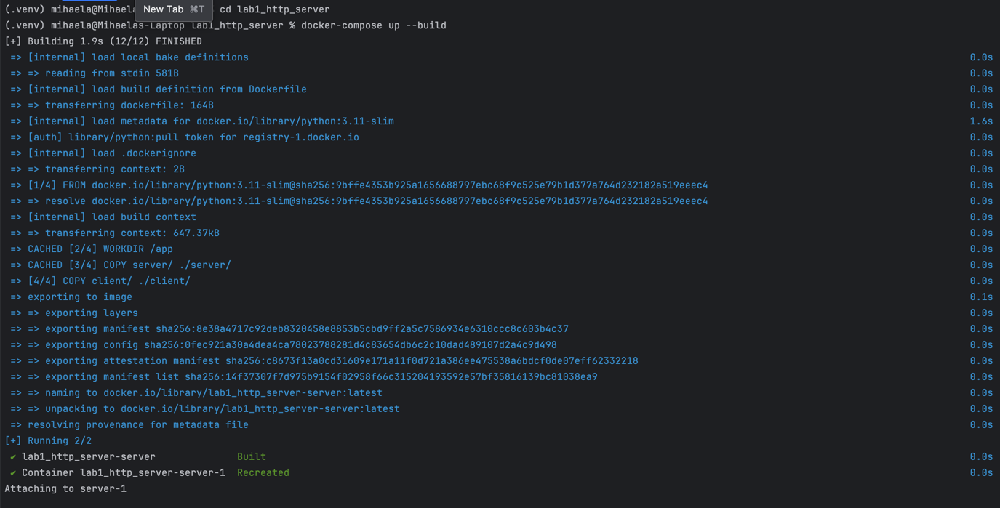
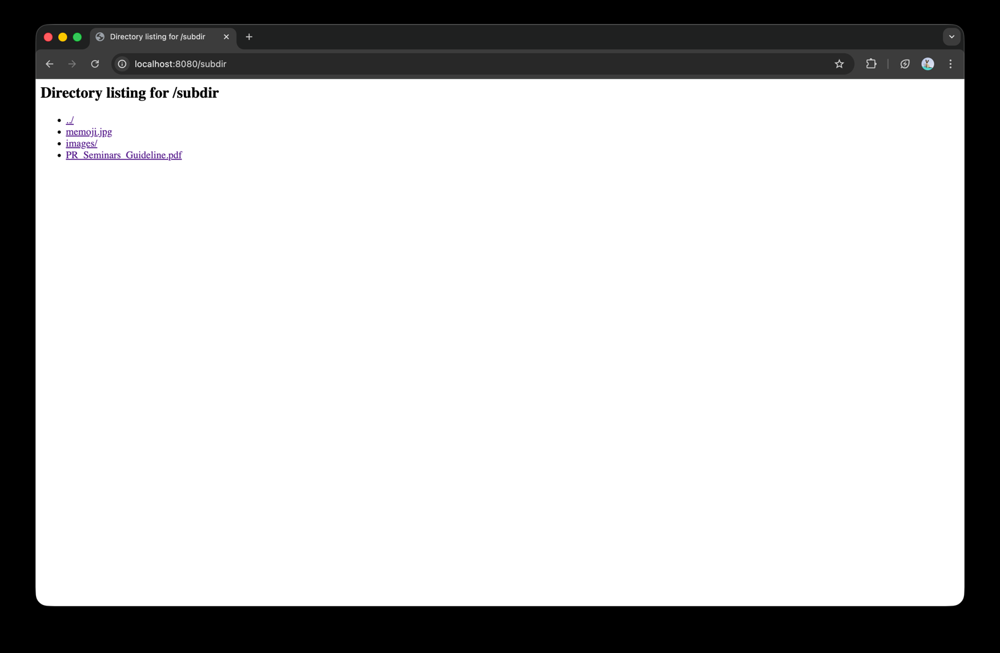

# Lab 1: HTTP File Server & Client

## 1. Source Directory Structure
The project contains the server and client implementations with the content to be served.


## 2. Docker Configuration Files
### docker-compose.yml
```yaml
services:
  server:
    build: .
    ports:
      - "8080:8080"
    command: python server/server.py
```

### Dockerfile
```dockerfile
FROM python:3.11-slim
WORKDIR /app
COPY server/ ./server/
COPY client/ ./client/
EXPOSE 8080
CMD ["python", "server/server.py"]
```

## 3. Starting the Container
Running the server using Docker Compose with making sure you are in the right directory `cd lab1_http_server` and `docker-compose up --build`:



## 4. Server Running Inside Container
After running the server, we can access it through a web browser at http://localhost:8080/. The browser sends HTTP 
requests to the server, which responds with the requested files.

The server is started inside the container and listens on port 8080, serving files from the `server/content` directory.


## 5. Contents of the Served Directory
The served directory contains HTML, PNG, and PDF files, as well as subdirectories.


## 6. Browser Requests

### 6.1. Request for Non-Existent File (404)
Requesting a file that doesn't exist returns a 404 Not Found error.


### 6.2. Request for HTML File with Embedded Image
The server successfully serves the HTML file `index.html` which displays embedded content.


### 6.3. Request for PDF File
Requesting a PDF file `Syllabus_PR_FAF-23x.pdf` - the browser opens or downloads it.


### 6.4. Request for PNG File
Requesting an image file `image.png` - the browser displays the image.


## 7. Client Implementation
### Running the Client
The client can request files from the server being in the right directory `cd lab1_http_server/client` using the command:
```shell
python3 client.py <server_host> <server_port> <filename>
```

### Client Output - HTML File
Requesting an HTML file prints its content to the terminal:

```shell
(.venv) mihaela@Mihaelas-Laptop client % python3 client.py localhost 8080 index.html
Status: HTTP/1.1 200 OK
HTML Content:
 <!doctype html>
<html>
<head>
  <meta charset="utf-8"/>
  <title>My PDF Library</title>
</head>
<body>
  <h1>My PDF Library</h1>
  <p>Below are example files for the lab.</p>

  <h2>Files</h2>
  <ul>
    <li><a href="/index.html">index.html</a></li>
    <li><a href="/Syllabus_PR_FAF-23x.pdf">Syllabus_PR_FAF-23x.pdf</a></li>
    <li><a href="/image.png">image (PNG)</a></li>
    <li><a href="/404.png">no such file (the 404 page)</a></li>
    <li><a href="/subdir/">subdir (directory listing)</a></li>
  </ul>

  <h2>Embedded image</h2>
  

</body>
</html>
```

### Client Output - Image and PDF Files
Requesting binary files saves them to the `downloads/` directory:

```shell
(.venv) mihaela@Mihaelas-Laptop client % python3 client.py localhost 8080 image.png 
Status: HTTP/1.1 200 OK
image.png to downloads/image.png
```

### Saved Files in Downloads Directory
The client successfully downloads and saves files locally:


### Client Request for Nested Directory Files
The client can request files from subdirectories:

```shell
(.venv) mihaela@Mihaelas-Laptop client % python3 client.py localhost 8080 "subdir/PR_Seminars_Guideline.pdf"

Status: HTTP/1.1 200 OK
subdir/PR_Seminars_Guideline.pdf to downloads/PR_Seminars_Guideline.pdf
```


### Client Handling 404 Errors
When requesting a non-existent file, the client receives a 404 response:

```shell
(.venv) mihaela@Mihaelas-Laptop lab1_http_server % python3 client.py localhost 8080 404.png
/Library/Frameworks/Python.framework/Versions/3.12/Resources/Python.app/Contents/MacOS/Python: can't open file '/Users/mihaela/Documents/UNIVERSITY/PR/lab1_http_server/client.py': [Errno 2] No such file or directory
```

## 8. Directory Listing Feature
When accessing a directory URL (e.g., `/subdir/`), the server generates an HTML page listing all files in that directory.


## 9. Browsing Friend's Server (Optional)
### Network Setup
Both my computer and my friend’s computer were connected to the same local Wi-Fi network (LAN).
This allowed direct communication between the two devices using their local IP addresses on port `8080`.
No VPN or Internet tunneling was used — the connection was fully local and handled over TCP sockets.
### Finding Friend's IP Address
My friend found their local IP address using the ipconfig (on Windows) command and shared it with me.


I verified my own IP using ifconfig (on macOS/Linux).


### Contents of Friend's Server
```shell
(.venv) mihaela@Mihaelas-Laptop client % python3 client.py 192.168.1.12  8080 index.html
Status: HTTP/1.1 200 OK
HTML Content:
 <html>
  <body>
    <h1>Test Page</h1>
    <p>This is served by my HTTP server.</p>
    
    <a href="doc.pdf">Download PDF</a>
  </body>
</html>
```

### Contents of Friend's Server
The friend’s server hosted the following files:


### Requests to Friend's Server Using Your Client
I used my own HTTP client to connect and download files from my friend’s server.
All files were successfully retrieved and saved into the local downloads/ directory.

```shell
(.venv) mihaela@Mihaelas-Laptop client % python3 client.py 192.168.1.12  8080 image.png
Status: HTTP/1.1 200 OK
image.png saved to downloads/image.png


(.venv) mihaela@Mihaelas-Laptop client % python3 client.py 192.168.1.12  8080 doc.pdf   
Status: HTTP/1.1 200 OK
doc.pdf saved to downloads/doc.pdf
```


## Conclusion
In this lab, we successfully implemented a basic HTTP file server and client in Python.
We demonstrated serving files, handling nested directories, and downloading files from a remote server.
All features were tested with HTML, PNG, and PDF files. The server correctly handles file requests, directory listings, and non-existent files with proper 404 responses.