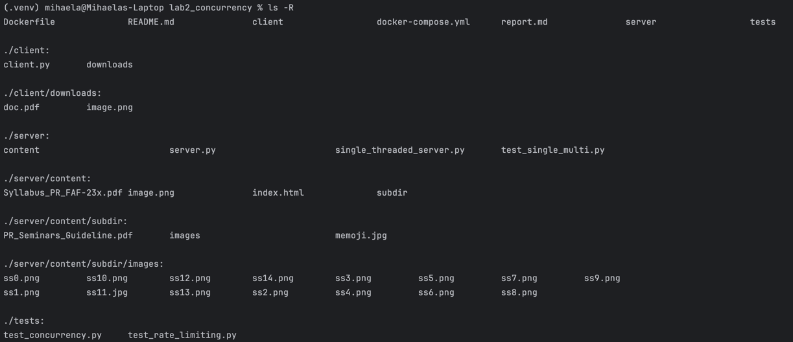
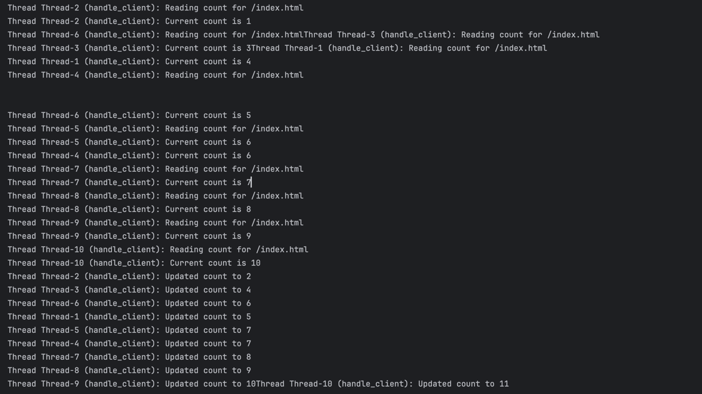

# Lab 2: Multithreaded HTTP Server

This lab implements a multithreaded HTTP server capable of handling concurrent connections, with added features for request counting and rate limiting.

## Project Structure



## Docker Configuration

### Dockerfile

```dockerfile
FROM python:3.11-slim
WORKDIR /app
COPY server/ ./server/
COPY client/ ./client/
EXPOSE 8080
CMD ["python", "server/server.py"]
```

### Docker Compose File

```yaml
services:
  server:
    build: .
    ports:
      - "8080:8080"
    command: python server/server.py

  single_threaded:
    build: .
    ports:
      - "8081:8080"
    command: python server/single_threaded_server.py
```

## Starting the Server

To start the server using Docker make sure you are in the correct directory `lab2_concurrency` and run:

```bash
docker-compose up --build
```

This builds the Docker image and starts the server on port 8080.

## Multithreaded HTTP Server Implementation

In this lab, I implemented a multithreaded HTTP server in Python that can handle multiple client connections at the same time.
The goal was to modify a basic single-threaded server so it could process requests concurrently, implement request counting, and add rate limiting for each client IP.

The server uses Python’s threading module — each client connection runs in a separate thread.
Alternatively, a thread pool could be used, but I chose the thread-per-request model because it’s easier to understand and clearly shows concurrency in action.

### Key Features

- **Multithreaded request handling**: Creates a new thread for each incoming connection
- **MIME type detection**: Serves different file types with appropriate content types
- **Directory listing**: Generates HTML listings of directories with file counts
- **Request counting**: Tracks the number of requests for each resource
- **Rate limiting**: Limits requests from each client IP to prevent abuse

## Concurrency Comparison

### Multithreaded vs. Single-threaded Server

To compare concurrency performance, I tested both single-threaded and multithreaded versions of the server.
I simulated 10 concurrent requests (each taking about 1 second) using a Python script with `ThreadPoolExecutor`.

| Server Type     | 10 Concurrent Requests | Processing Time | Average Response Time |
|-----------------|------------------------|-----------------|-----------------------|
| Single-threaded | Sequential processing  | ~10.58 seconds  | 5.73 seconds          |
| Multithreaded   | Parallel processing    | ~1.22 seconds   | 1.13 seconds          |

The single-threaded server processes one request at a time, so total time grows linearly. The multithreaded server achieves significantly better throughput by handling multiple requests concurrently, which is essential for real-world web server applications.

## Request Counter Implementation

The request counter tracks how many times each resource has been accessed. This feature demonstrates thread synchronization concepts.
Each resource (like index.html or /subdir/) has its own counter stored in a dictionary.

### Naive Implementation (Race Condition)

At first, I implemented it without synchronization, which caused race conditions when several threads updated the same counter at once.

```python
hit_counter[path] = hit_counter.get(path, 0) + 1
print(f"Thread {threading.current_thread().name}: Reading count for {path}")
current_count = hit_counter[path]
print(f"Thread {threading.current_thread().name}: Current count is {current_count}")
time.sleep(0.1)  # delay to force interleaving
print(f"Thread {threading.current_thread().name}: Updated count to {current_count + 1}")
```

This implementation is vulnerable to race conditions. When multiple threads access the counter simultaneously:
1. Thread A reads the current count (e.g., 5)
2. Thread B reads the current count (also 5)
3. Thread A increments and stores the count (now 6)
4. Thread B increments and stores the count (also 6)
5. The count should be 7, but it's 6 due to the race condition

### Race Condition (No Lock) Example


Multiple threads read the same hit_counter value before any of them writes back.

Example:

```
Thread-4: Current count is 6
Thread-5: Current count is 6
```


Both threads see 6 at the same time.

Then they update the counter independently:
```
Thread-4: Updated count to 7
Thread-5: Updated count to 7
```
The final count should have increased by 2, but it only increased by 1 — a classic race condition.

### Thread-safe Implementation (With Lock)

The thread-safe implementation uses a lock to ensure atomic operations:

```python
with counter_lock:
    hit_counter[path] = hit_counter.get(path, 0) + 1
    print(f"Thread {threading.current_thread().name}: Reading count for {path}")
    current_count = hit_counter[path]
    print(f"Thread {threading.current_thread().name}: Current count is {current_count}")
    time.sleep(0.1)  # delay to force interleaving
    print(f"Thread {threading.current_thread().name}: Updated count to {current_count + 1}")
```

With the lock, only one thread can modify the counter at a time, preventing race conditions.
This prevents incorrect counts caused by overlapping read/write operations.
To make race conditions more visible during testing, I added a small time.sleep(0.1) delay inside the locked section — this allowed me to see how threads interleave.

### Race Condition (With Lock) Example

Each thread waits its turn to enter the with counter_lock: block.
```
Thread-1: Current count is 1 → Updated count to 2
Thread-4: Current count is 2 → Updated count to 3
Thread-2: Current count is 3 → Updated count to 4
```

Even though threads started roughly at the same time, the lock enforces one-at-a-time access, so there’s no race condition anymore. The counter increments properly without skipping or overwriting values.

The order is not necessarily Thread-1, Thread-2, …. Thread scheduling is done by the OS, so whichever thread reaches the lock first gets to run.
```
Thread-1 → Thread-4 → Thread-2 → Thread-5 …
```
This is normal in multithreaded programs.


### Counter Display in Browser
The request counter is displayed on each served page, showing how many times that resource has been accessed.


If there are too many requests (more than 5 per second) happening simultaneously, the browser will display the `429 Too Many Requests` error due to rate limiting.


### Observation

When requesting a directory (/subdir), extra requests are sometimes counted.
This happens because the browser may request additional files inside the folder (like thumbnails or embedded images). Therefore, directory counters may increase by more than one per access.

## Rate Limiting Implementation

To prevent one client from spamming the server, I added IP-based rate limiting.
- Each client IP is limited to 10 requests per second
- Requests exceeding the limit receive a 429 Too Many Requests response
- Thread-safe implementation using per-IP locks and a global lock

### Rate Limiting Performance

Testing with two clients:
1. **Spammer Client**: Sends many rapid requests (exceeding rate limit)
2. **Controlled Client**: Sends requests at a controlled rate (below rate limit)

| Client Type | Requests Sent | Successful | Rate Limited | Success Rate | Time  |
|-------------|---------------|------------|--------------|--------------|-------|
| Spammer     | 20            | 7          | 13           | ~50%         | 0.79s |
| Controlled  | 10            | ~10        | 0            | ~100%        | 3.63s |

The rate limiting effectively prevents a single client from overwhelming the server while allowing well-behaved clients to access resources reliably.

### Experimental Observations

- When concurrency is enabled, the shared request_counter and rate_limit dictionaries must be locked to prevent data corruption.
- The controlled client was unaffected by the spammer thanks to independent per-IP rate locks.
- Removing artificial time.sleep() delays resulted in extremely fast tests (e.g., 0.22s) — but such delays are useful for visualizing interleaving.
- Directory requests may count more hits due to multiple sub-resource fetches.
- The concurrent version demonstrates realistic web-server-like behavior where multiple threads process requests simultaneously.

## Conclusion

This multithreaded HTTP server implementation demonstrates several important concepts:
1. Improved performance through concurrent request handling
2. Thread synchronization to prevent race conditions
3. Resource protection through rate limiting

These features make the server more robust and efficient for real-world use cases, handling multiple clients while protecting against abuse.
