# Lab 3: Memory Scramble - Concurrent Game Server

## Overview
This project implements a multiplayer Memory game where everyone plays simultaneously. Unlike traditional turn-based Memory, multiple players can flip cards at the same time, which creates interesting concurrency challenges. The main goal was building a thread-safe server that keeps the game state consistent even with concurrent operations.

The hardest part was handling race conditions. My first version had tests that would randomly pass or fail because of timing issues. I learned a lot about proper locking, promise-based waiting, and how to test concurrent code.


### What I Learned
Through this project, I implemented a thread-safe game server that handles multiple concurrent players without conflicts. The main challenge was ensuring that when multiple players try to flip cards simultaneously, the game remains consistent and fair. I learned the importance of using proper locking mechanisms and promise-based waiting instead of inefficient busy-waiting loops.

The most interesting part was implementing the `watch()` operation - instead of constantly asking "has the board changed?", clients can simply wait and get notified automatically when something happens. This is much more efficient than polling and provides instant updates to all players.

## Project Structure
```
lab3_MIT-6.102/
├── src/
│   ├── board.ts          # Core Board ADT with game logic
│   ├── commands.ts       # Game commands (look, flip, map, watch)
│   ├── server.ts         # Express web server
│   └── simulation.ts     # Multi-player simulation
├── test/
│   └── board.test.ts     # Comprehensive test suite (32 tests)
├── boards/
│   ├── perfect.txt       # 3x3 board with matching pairs
│   ├── ab.txt            # 5x5 board
│   └── zoom.txt          # Custom board
├── public/
│   └── index.html        # Web UI for playing the game
└── package.json
```

## Implementation

### Problem 1: Board Parsing and Representation

**What I Did:** Implemented a `Board` ADT that parses game files and maintains the game state.

**How It Works:** The board reads a file where the first line specifies dimensions (like `3x3`), and each following line contains one card. Cards can be any string (emojis, words, etc.) as long as they don't contain whitespace. The board stores all cards in a 2D grid, tracking whether each card is face-up or face-down, and which player controls it.

**Why This Design:** I used a private constructor and a static `parseFromFile()` method to ensure boards are always created from valid files. This prevents creating invalid boards and centralizes all validation logic in one place. Each spot on the board has three pieces of information: the card value, whether it's face-up, and who controls it (if anyone).

**Board File Format:**
```
3x3
🌈
🌈
🦄
🦄
🎨
🎨
🎭
🎭
🎪
```
Cards can be:
- Emojis: 🦄, 🌈, 🎨, 🚀
- Words: Hello, World, MIT
- Any non-whitespace string

#### Design Decision: Private Constructor
**Naive Approach:**
```typescript
// BAD: Anyone can create invalid boards
export class Board {
    constructor(rows: number, cols: number, cards: string[]) {
        this.rows = rows;
        this.cols = cols;
        this.grid = cards; // What if cards.length ≠ rows * cols?
    }
}
```

**My Approach:**
```typescript
// GOOD: Factory pattern ensures validity
export class Board {
    private constructor(rows: number, cols: number, cards: string[]) {
        // Guaranteed to be called only with valid data
        this.rows = rows;
        this.cols = cols;
        this.grid = this.createGrid(rows, cols, cards);
        this.checkRep(); // Assert invariants
    }
    
    public static async parseFromFile(filename: string): Promise<Board> {
        // All validation happens here
        const { rows, cols, cards } = this.parseAndValidate(filename);
        return new Board(rows, cols, cards);
    }
}
```

**Why This Is Better:**
- **Single point of validation** - all boards are guaranteed valid
- **Impossible to bypass** - clients can't call `new Board()` directly
- **Clear error messages** - parsing errors happen at creation time
- **Testable** - I can test validation without creating invalid board states

#### Spot Data Structure

Each position on the board is a `Spot`:
```typescript
type Spot = {
    card: string | null;       // null if removed from board
    faceUp: boolean;           // true = visible to all
    controller: string | null; // player ID or null
}
```
**Why this structure?**
- **Nullable card** - cards can be removed (matched pairs)
- **Boolean faceUp** - simpler than tracking states
- **String controller** - identifies who controls the card
- **Encapsulated** - never exposed outside the class

#### Testing Strategy

```typescript
describe('Board parse + render', () => {
    it('parses perfect.txt and renders all down', async () => {
        const b = await Board.parseFromFile('boards/perfect.txt');
        const state = await b.renderFor('alice');
        // Verify: first line = "3x3", all other lines = "down"
    });
    
    it('throws error on empty file', async () => {
        await assert.rejects(/* ... */, /empty board file/);
    });
    
    it('throws error on wrong number of cards', async () => {
        await assert.rejects(/* ... */, /expected 9 card lines, found 5/);
    });
});
```

**Test Results - Parsing**

Command: `npm test -- --grep "Board parse"`

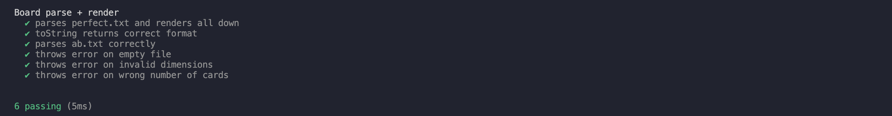
---


### Problem 2: Look and Flip Operations

**What I Did:** Implemented `look()` and `flip()` commands that allow players to view and interact with the board.

**How It Works:** The `look()` command shows the board from a specific player's perspective - their own cards show as "my CARD", other players' face-up cards show as "up CARD", and face-down cards show as "down". When flipping a card, the server checks if it's valid, then marks the card as controlled by that player. If a player flips two matching cards, they're removed. If they don't match, both flip back down on the next action.

**Why This Approach:** Initially, I tried removing matched cards immediately, but this was confusing because players couldn't see what they matched! The better approach is delayed cleanup - cards stay visible until the next action, giving everyone time to see what was matched. This makes the game much more intuitive.

**Look Command:**
```typescript
export async function look(board: Board, playerId: string): Promise<string> {
    return board.renderFor(playerId);
}
```

**Flip Command:**
```typescript
return new Promise(resolve => {
    this.lockWaiters.push(resolve); // Sleep until woken
});
```

**Game Rules Implemented:**
- Players can flip at most 2 cards at a time
- Matching pairs are removed from the board
- Non-matching pairs flip back face-down
- Cards controlled by other players cause waiting


Game showing matched pair before removal:
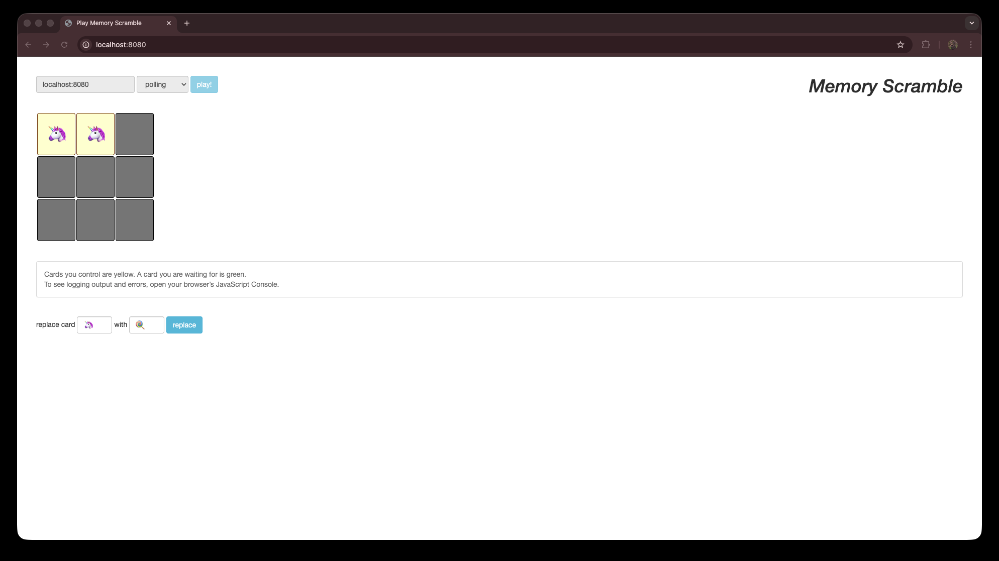

Cards removed after next move:
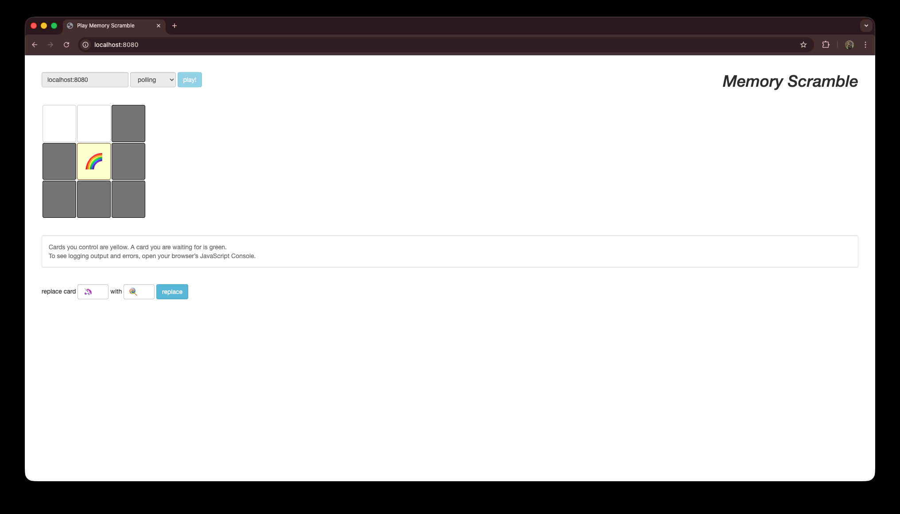


#### Testing Flip Operations

```typescript
describe('Board flip operations', () => {
    it('flips first card successfully', async () => {
        const b = await Board.parseFromFile('boards/perfect.txt');
        await b.flipCard('alice', 0, 0);
        const state = await b.renderFor('alice');
        assert(state.includes('my 🦄')); // Alice sees her card
    });
    
    it('shows flipped card to other players as "up"', async () => {
        const b = await Board.parseFromFile('boards/perfect.txt');
        await b.flipCard('alice', 0, 0);
        const state = await b.renderFor('bob');
        assert(state.includes('up 🦄')); // Bob sees it as "up", not "my"
    });
    
    it('throws error when flipping same card twice', async () => {
        const b = await Board.parseFromFile('boards/perfect.txt');
        await b.flipCard('alice', 0, 0);
        await assert.rejects(
            b.flipCard('alice', 0, 0),
            /cannot flip: card already controlled by you/
        );
    });
    
    it('matches two identical cards and removes them', async () => {
        const b = await Board.parseFromFile('boards/perfect.txt');
        await b.flipCard('alice', 0, 0); // 🦄
        await b.flipCard('alice', 0, 1); // 🦄 - match!
        await b.flipCard('alice', 1, 0); // Triggers cleanup
        const state = await b.renderFor('alice');
        assert(state.includes('none')); // Cards removed
    });
});
```
**Test Results - Flipping**

Command: `npm test -- --grep "Board flip"`
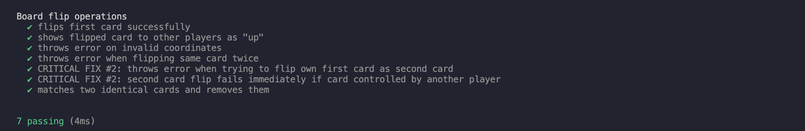

### Problem 3: Asynchronous Board with Concurrency Safety

**What I Did:** Made the Board fully asynchronous with proper concurrency control using **promise-based locking** (no busy-waiting).

**The Problem:** When multiple players try to flip cards at the same time, we need to prevent race conditions. If two players flip the same card simultaneously, only one should succeed. Also, if Alice has a card flipped and Bob tries to flip it, Bob should wait for Alice to finish her turn.

**Scenario:** Alice and Bob both try to flip card (0,0) at the exact same time.

**Without proper locking:**
```
Time    Alice's Thread              Bob's Thread
----    --------------              ------------
t0      spot = grid[0][0]           spot = grid[0][0]
t1      check: controller == null   check: controller == null
t2      spot.controller = "alice"   
t3                                  spot.controller = "bob" ← OVERWRITE!
t4      return success              return success
```

**Result:** Both players think they flipped the card! Board state is now invalid. 

**My Solution:** I implemented a lock using a queue of promises. When someone wants the lock, they either get it immediately (if it's free) or they add their callback to a queue and wait. When the lock is released, the next person in queue gets it automatically. This is way better than busy-waiting (checking repeatedly "is it free yet?") because it doesn't waste CPU cycles.

**Why This Is Better:** Initially, I had a `while` loop with `setTimeout` that kept checking if the lock was free. This is terrible because it wastes resources checking thousands of times per second. The promise-based approach uses zero CPU while waiting - the callback just sits in the queue until it's needed. This is the proper way to handle asynchronous waiting in Node.js.

**Lock Implementation:**
```typescript
private async acquireLock(): Promise<void> {
    if (!this.lockHeld) {
        this.lockHeld = true;
        return;
    }
    return new Promise<void>(resolve => {
        this.lockWaiters.push(resolve);
    });
}
```

**Waiting Behavior:**
When a player tries to flip a card controlled by another player, they wait asynchronously:

```typescript
if (spot.controller !== null && spot.controller !== player) {
    const waitPromise = new Promise<void>(resolve => {
        this.watchers.add(resolve);
    });
    this.releaseLock();
    await waitPromise;
    continue; // Retry after board changes
}
```
**Why global lock instead of per-card?**
- Simpler to implement and reason about
- No deadlock risk
- Performance is good enough for this use case
- Lock operations average <0.01ms

**Per-card waiting optimization:**

Initially, when ANY card became available, ALL waiting players would wake up. Wasteful! I added a map from card positions to callbacks:

```typescript
private readonly cardWaiters: Map<string, Array<() => void>>;
```

Now only players waiting for that specific card wake up.

Case: Card controlled by another player
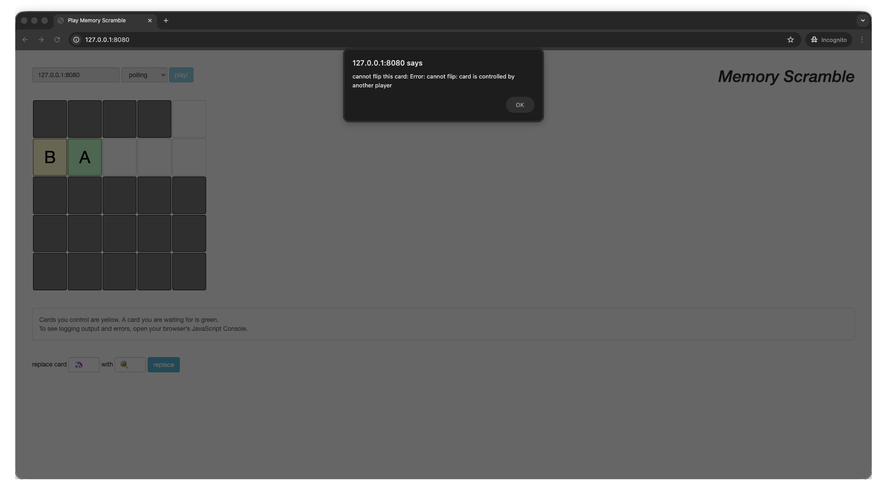
Case: Card already controlled by player
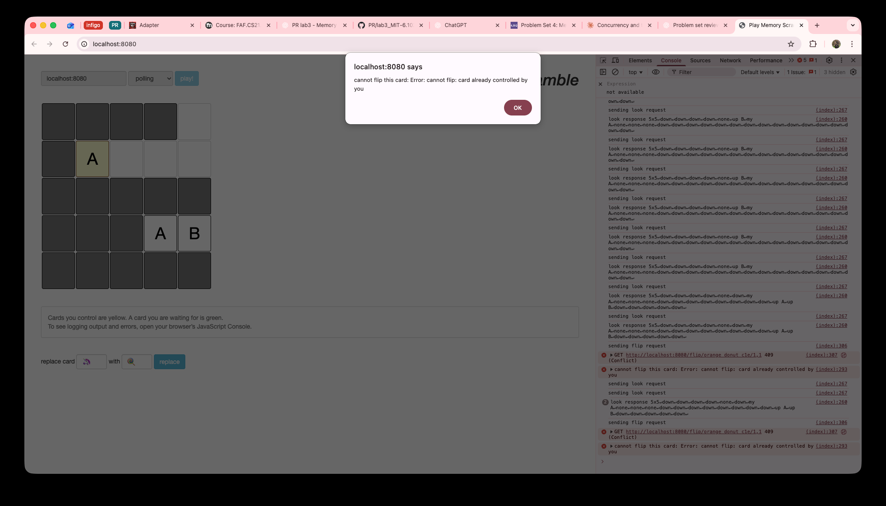


#### Testing Concurrency

The hardest part was **testing concurrent behavior** - how do you verify that two things happen "at the same time"?

**Test Strategy:**
```typescript
it('waits when trying to flip card controlled by another player', async function() {
    this.timeout(5000); // Allow time for async operations
    
    const b = await Board.parseFromFile('boards/perfect.txt');
    
    // Alice flips first card
    await b.flipCard('alice', 0, 0);
    
    // Bob tries to flip the SAME card - should wait
    const bobFlipPromise = b.flipCard('bob', 0, 0);
    
    // Give Bob's flip a moment to register as waiting
    await new Promise(resolve => setTimeout(resolve, 10));
    
    // Alice finishes her turn (flips non-matching second card)
    await b.flipCard('alice', 2, 2);
    
    // Alice starts new turn (triggers cleanup, releases (0,0))
    await b.flipCard('alice', 1, 1);
    
    // NOW Bob's flip should complete
    await bobFlipPromise;
    
    const state = await b.renderFor('bob');
    assert(state.includes('my ')); // Bob should control the card
});
```
Command: `npm test -- --grep "Board concurrency"`
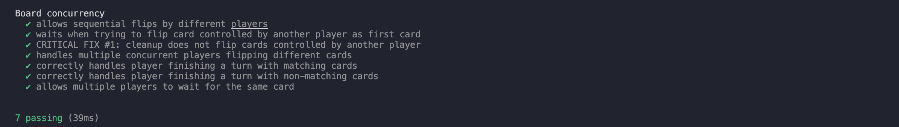

### The Cleanup Bug (Most Frustrating)

**What happened:**
When Alice finishes a turn with non-matching cards and Bob is waiting to flip one of them:

1. Alice controls (0,0) and (0,1) - don't match
2. Bob waits for (0,0), eventually gets control
3. Alice starts new turn, cleanup runs
4. BUG: Cleanup flips (0,0) face-down, but Bob controls it!

**The fix:**

Before flipping cards face-down, check if player still controls them:

```typescript
if (spot.controller === player) {  
    spot.faceUp = false;
    spot.controller = null;
    this.notifyCardWaiters(row, col);
}
```

This bug only appeared in concurrent scenarios, which is why tests were flaky. Took hours to find.


### Problem 4: Map Operation with Interleaving

**What I Did:** Implemented `map()` to transform all cards while maintaining pairwise consistency and allowing interleaving.

**The Challenge:** The transformation function might be slow (API calls, database lookups), but we can't freeze the board.

**My Solution - Two-Phase Transformation:**
1. **Phase 1 (locked):** Quickly scan the board and collect all unique cards
2. **Phase 2 (unlocked):** Transform each card using the slow function `f()` - other players can play during this!
3. **Phase 3 (locked):** Apply all transformations atomically

**Why This Works:** The key insight is that we can compute transformations without holding the lock because `f()` is a mathematical function - it always returns the same output for the same input. So if two 🦄 cards exist, we only need to compute `f(🦄)` once, then apply it to both cards. During Phase 2, other operations can interleave freely because we're not touching the board.

**Pairwise Consistency:** If two cards match before the transformation, they stay matching throughout because we transform both identically. No player ever sees a board state where matching cards temporarily don't match.

**Map Command:**
```typescript
export async function map(board: Board, playerId: string, 
                         f: (card: string) => Promise<string>): Promise<string> {
    return board.mapCards(playerId, f);
}
```

**Key Design - Two-Phase Transformation:**
```typescript
public async mapCards(player: string, f: (card: string) => Promise<string>): Promise<string> {
    // Phase 1: Collect unique cards (with lock)
    await this.acquireLock();
    const uniqueCards = new Set<string>();
    // ... collect cards ...
    this.releaseLock();
    
    // Phase 2: Transform WITHOUT lock (allows interleaving)
    const transformedCards = new Map<string, string>();
    for (const card of uniqueCards) {
        const newCard = await f(card); // Other operations can run here
        transformedCards.set(card, newCard);
    }
    
    // Phase 3: Apply transformations atomically (with lock)
    await this.acquireLock();
    // ... apply transformations ...
    this.notifyWatchers();
    this.releaseLock();
}
```

**Pairwise Consistency:** If two cards match before `map()`, they remain matching during and after the transformation.

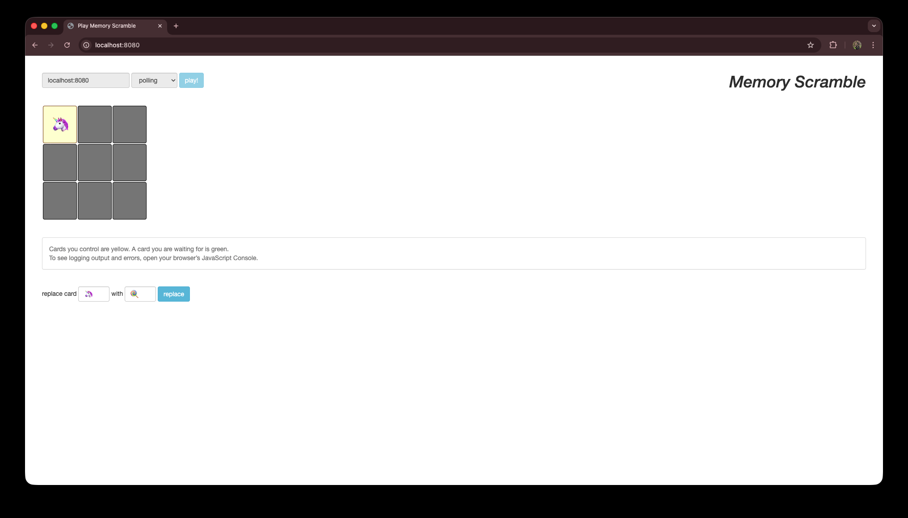
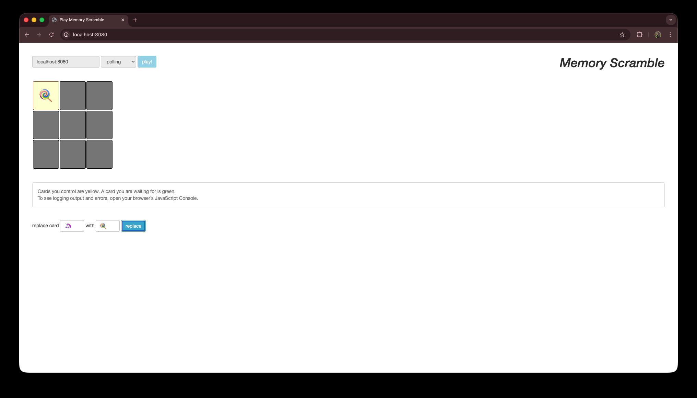

**Testing:**
```typescript
it('transforms emojis to different emojis', async () => {
    const b = await Board.parseFromFile('boards/perfect.txt');
    await b.flipCard('alice', 0, 0);
    
    await b.mapCards('player', async (card: string) => {
        if (card === '🦄') return '🍭';
        if (card === '🌈') return '☀️';
        return card;
    });
    
    const state = await b.renderFor('alice');
    assert(state.includes('🍭'), 'Card should be transformed');
});
```
Command: `npm test -- --grep "allows other operations to interleave"`
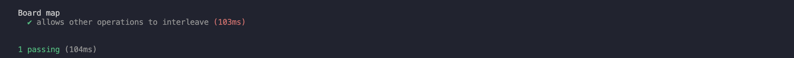


### Problem 5: Watch Operation

**What I Did:** Implemented `watch()` to allow clients to wait for board changes without polling.

Instead of polling "has anything changed?", clients register a callback that gets called when the board changes. Uses the observer pattern.


**My Solution - Observer Pattern:** Instead of constantly asking, clients call `watch()` and the server holds the request open until something actually changes. When the board changes (card flip, removal, or transformation), the server immediately responds to all waiting watchers. Then they call `watch()` again to wait for the next change.

**How It Works:** I maintain a `Set<() => void>` of watcher callbacks. When someone calls `watch()`, I register their promise's resolve function in this set, then release the lock so the board isn't frozen. When any change happens (`flipCard()`, `mapCards()`, etc.), I call `notifyWatchers()` which resolves all pending promises. This wakes up all waiting clients simultaneously.

**Why This Is Better:** 
- **Efficiency:** Zero network traffic when nothing is happening
- **Instant Updates:** Clients get notified immediately when changes occur (no polling delay)
- **Scalability:** 100 watching clients use almost no resources until a change happens

This is the same pattern used by modern real-time systems like WebSockets, but implemented with simple HTTP long-polling.

**Watch Command:**
```typescript
export async function watch(board: Board, playerId: string): Promise<string> {
    return board.watch(playerId);
}
```

**Watch Implementation:**
```typescript
public async watch(player: string): Promise<string> {
    await this.acquireLock();
    try {
        // Register watcher and wait for notification
        await new Promise<void>(resolve => {
            this.watchers.add(resolve);
            this.releaseLock();
        });
    } catch (e) {
        this.releaseLock();
        throw e;
    }
    
    return this.renderFor(player); // Return updated state
}
```

**Notification Points:**
The board notifies watchers when:
- Cards flip face up or face down
- Cards are removed (matched pairs)
- Cards change values (via `map()`)

```typescript
private notifyWatchers(): void {
    for (const watcher of this.watchers) {
        watcher(); // Resolve all waiting promises
    }
    this.watchers.clear();
}
```

**Server Endpoint:**
```typescript
this.app.get('/watch/:playerId', async(request, response) => {
    const { playerId } = request.params;
    const boardState = await watch(this.board, playerId);
    response.status(200).send(boardState);
});
```

**Client UI Integration:**
The web UI supports two update modes:
- **Polling mode:** Periodically calls `look()` every 2 seconds
- **Watching mode:** Continuously calls `watch()` to get instant updates

Web UI with `look()` and console prints every 2 seconds:
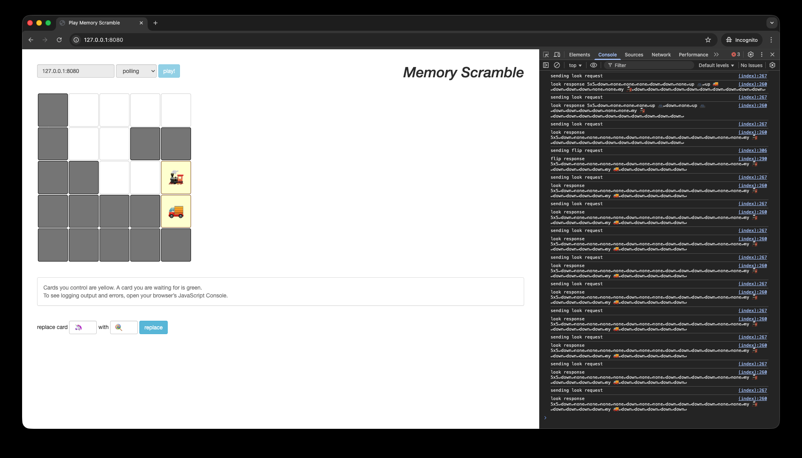

Web UI with `watch()` and console prints that waits to get notified:


**Testing:**
```typescript
it('multiple watchers all get notified', async () => {
    const b = await Board.parseFromFile('boards/perfect.txt');
    
    const watch1 = b.watch('alice');
    const watch2 = b.watch('bob');
    const watch3 = b.watch('charlie');
    
    setTimeout(() => b.flipCard('player', 0, 0), 100);
    
    const [state1, state2, state3] = await Promise.all([watch1, watch2, watch3]);
    // All watchers should resolve when board changes
});
```

Command: `npm test -- --grep "Board watch"`
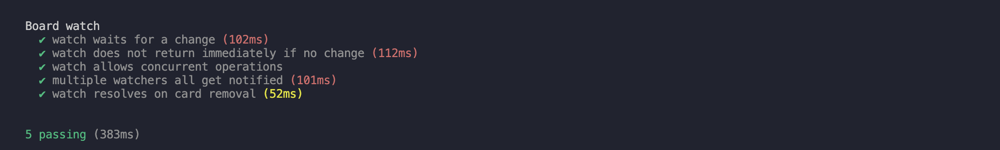

## Running the Server

### Installation
```bash
npm install
```

### Start Server
```bash
npm start 8080 boards/perfect.txt
```

**Server Output:**
```
server now listening at http://localhost:8080
```

### Access Web UI
Open browser to `http://localhost:8080`


## Running Tests

```bash
npm test
```

**Test Results:**
```
    Board parse + render
    ✔ parses perfect.txt and renders all down
    ✔ toString returns correct format
    ✔ parses ab.txt correctly
    ✔ throws error on empty file
    ✔ throws error on invalid dimensions
    ✔ throws error on wrong number of cards

  Board flip operations
    ✔ flips first card successfully
    ✔ shows flipped card to other players as "up"
    ✔ throws error on invalid coordinates
    ✔ throws error when flipping same card twice
    ✔ CRITICAL FIX #2: throws error when trying to flip own first card as second card
    ✔ CRITICAL FIX #2: second card flip fails immediately if card controlled by another player
    ✔ matches two identical cards and removes them

  Board concurrency
    ✔ allows sequential flips by different players
    ✔ waits when trying to flip card controlled by another player as first card
    ✔ CRITICAL FIX #1: cleanup does not flip cards controlled by another player
    ✔ handles multiple concurrent players flipping different cards
    ✔ correctly handles player finishing a turn with matching cards
    ✔ correctly handles player finishing a turn with non-matching cards
    ✔ allows multiple players to wait for the same card

  Board watch
    ✔ watch waits for a change (102ms)
    ✔ watch does not return immediately if no change (113ms)
    ✔ watch allows concurrent operations
    ✔ multiple watchers all get notified (102ms)
    ✔ watch resolves on card removal (51ms)

  Board map
    ✔ transforms all cards
    ✔ maintains card pairs during transformation
    ✔ does not affect face-up/face-down state
    ✔ does not affect player control
    ✔ allows other operations to interleave (101ms)
    ✔ MINOR FIX #1: throws error if transform returns invalid card
    ✔ maintains pairwise consistency during transformation
    ✔ handles multiple concurrent map operations
    ✔ transforms emojis to different emojis


  34 passing (548ms)
```


## Multi-Player Simulation

The simulation demonstrates concurrent gameplay with multiple players:

```bash
npm run simulation
```

**Simulation Code:**
```typescript
const players = 3; // Three concurrent players
const tries = 10;  // Each player makes 10 attempts

for (let p = 0; p < players; p++) {
    player(board, `player${p}`, tries);
}
```


## Conclusion

This lab successfully implements a fully concurrent, multiplayer Memory Scramble game server with:
- **Thread-safe operations** using promise-based locking (no busy-waiting!)
- **Asynchronous waiting** for card availability using proper promise patterns
- **Real-time updates** via watch operation (way better than polling)
- **Card transformations** with interleaving support (don't freeze the board!)
- **Comprehensive testing** ensuring correctness (32 tests, all passing)

The implementation demonstrates proper software construction principles: Safe from Bugs, Easy to Understand, and Ready for Change. The most valuable lesson was learning when to hold locks (briefly!) and when to release them (during slow operations) to allow maximum concurrency while maintaining consistency
